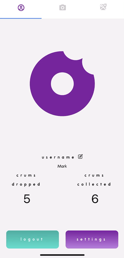
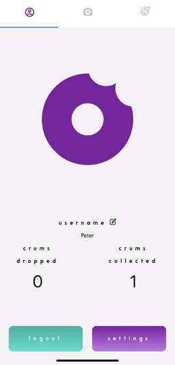
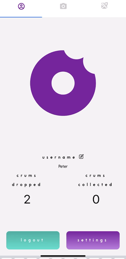
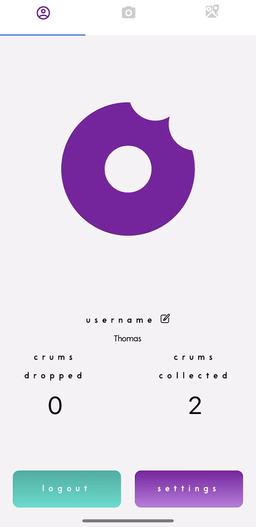

# Crum - Explore & Share on an Interactive Location-based Augmented Reality Platform 

***Crum*** is a social mobile application that allows users to create, collect, and comment on “Crums” - digital images with personalized messages superimposed onto the real world.

*Developed by Thomas Zhang, Mark Czernyk, April (TianXin) Angland and Peter (CHAOHUI) Chen*

# Setup

*Note: iPhone 6s or newer is recommended for optimal performance*

- Run `git clone https://github.com/TeamKnown/Crum.git` and open up the project in your code editor of choice
- On your phone, download Expo Client in the Apple App Store
- In your code editor, from the project root directory, run `npm install`
- Run `brew cask install ngrok` then run `ngrok http 19001` and you will be provided a “Forwarding” link formatted as such: `http://bf5e2801.ngrok.io`
- Copy this link and navigate to secretDom.js in the project root directory
- Set “export const BASE_URL” to your ngrok forwarding link
- Leave ngrok open in this terminal window
- In a new terminal window, run `npm run start-dev` to be redirected to localhost
- In localhost, you will see a QR code. Open up the camera on your iPhone and scan this code
- Once the QR code is detected, you will receive a push notification to open the “exp” link, click on this and Expo will start downloading the JavaScript bundle
- Log in or sign up and start dropping some Crums!

## Tech Stack

Front-End

- [Expo](https://expo.io/learn)
- [Expo-Three](https://github.com/expo/expo-three)
- [React](https://facebook.github.io/react/)
- [React-Native](https://github.com/facebook/react-native)
- [React-Native-Navigation](https://github.com/wix/react-native-navigation)
- [React-Native-Maps](https://github.com/react-native-community/react-native-maps)
- [Redux](https://redux.js.org/)

Back-end

- [Node.js](https://nodejs.org/en/)
- [Express](http://expressjs.com/)
- [PostgreSQL](https://www.postgresql.org/)
- [Ngrok](https://ngrok.com/)

# Features

## Detect Device

To account for AR compatibility on different devices, we automatically detect the user's phone model in the *Settings* page. The user has the ability to modify these settings to accommodate their device.

  

## Public Crums

Users can drop a Crum to the public and specify the number of times it can be collected.

A **public** Crum is available for **all** users to collect, but no one is allowed to collect the same Crum twice. After the last Crum is collected, it disappears from the AR view

<em minWidth=’24%’>Exhibit 1: April taps anywhere within the AR view, selects a Crum, specifies the amount, includes a message, and confirms the drop. Users can then comment on or collect the Crum.</em> 
<em minWidth=‘24%’>Exhibit 2: Mark leaves a comment and collects the Crum, which is then shown in his user profile.</em> 
<em minWidth=‘24%’>Exhibit 3: Peter comes across the same Crum. He also comments on and collects it.</em> 
<em minWidth=‘24%’>Exhibit 4: Thomas picks up the last Crum, so it immediately disappears from the AR view.</em> 

Dropped and Collected Crums are recorded in the user's Profile

<em minWidth=’24%’>Exhibit 1: April is able to check her history of dropped Crums in her User Profile. She can also see which user has collected her Crum.</em> 
<em minWidth=‘24%’>Exhibit 2: Mark, Peter and Thomas each check their history of collected Crums.</em> 

## Private Crums

A user who drops a **private** Crum must specify a designated recipient. We differentiate private Crums from public Crums by adding a colored ring around them. Users who drop a private Crum see a purple ring around it. The recipient of the private Crum sees a teal ring around it. Private Crums are immediately removed from the AR view once collected.

<em minWidth=’24%’>Exhibit 1: Peter just wants to leave some healthy snacks for Thomas. He selects the private Crum option, specifies the recipient name, and confirms the drop.</em> 
<em minWidth=‘24%’>Exhibit 2: Thomas comes across a teal-bordered Crum, so he knows it was personally dropped for him. Since he is the recipient, he is able to collect the Crum.</em> 

Similar to the AR view, privately dropped and collected Crums are recorded in the user's Profile with purple and teal borders respectively.

## Map

The *Map View* shows all nearby public and private Crums, indicated by color. Swiping through the carousel at the bottom of this screen brings the user to each Crum's location, where they can see a message preview. If the user wants to go collect or comment on a Crum, they can click on its icon to see how far away it is from the user’s current location and even get directions

<em minWidth=’30%’>Exhibit 1: Thomas swipes through the carousel of nearby Crums to see what users have been dropping.</em> 
<em minWidth=‘30%’>Exhibit 2: Each Crum is displayed with an ETA along with a brief description.</em> 

  
  

# Technical Highlights

*Rendering Crums at Exact Location*: 
We initially rendered Crums using longitude and latitude alone, but that did not provide very precise results, as the orientation of a Crum relative to the user is determined by their device camera. For example, if a Crum is south of a user, and the user is facing north, then the Crum should show up behind the user, not in front of them. To solve this problem, we used the iPhone's internal compass to determine which way a user is facing, then derived where in the camera view to populate the Crum.

# Challenges & Takeaways

*Communication in a Remote Setting*: 
We worked in a remote setting, where proactive over-communication is essential. Because we were not able to see each other face to face, we took extra effort to keep the team updated with our current work and upcoming plans. 

*Prioritization*: 
We faced a tight time constraint (2.5 weeks) for this project. To ensure that we had a fully functional product, we broke down our project requirements into tiers that prioritized essential features and complete user experiences. We did not end up building all of the features we wanted, but we have a very well rounded product. 

# Features - time permitting and stretch goals
- Socket.io integration to allow users at the same latitude/longitude coordinates to see Crum updates in real time
- Add a friend's list component to the User Profile that allows users to add, edit, and delete friends
- Chat functionality to allow users to communicate with each other
- Render 3D objects in the AR view
- Allow users to upload their own images to create unique Crums

